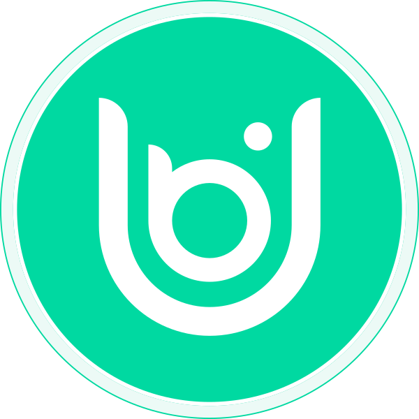

# UBI Chain

A very tiny blockchain for browsers. 

## Features

  - [X] Spin up a node from a browser.
  - [X] One node per human via [Proof of Humanity](https;//github.com/Proof-of-Humanity)
  - [X] [UBI](https://github.com/DemocracyEarth/ubi) for gas and fees.
  
## Available Scripts

In the project directory, you can run:

### `npm run rpc`

Runs the JSON RPC Server for Ethereum-compatible wallets.\
Open [http://localhost:8585](http://localhost:8585) to interact with JSON RPC commands.

### `npm run relayer`

Runs Relay Server that will connect with other peers on the network.\
Peers will be able discover other connected nodes on the network.

### `npm start`

Runs the chain on the browser in the development mode.\
Open [http://localhost:3000](http://localhost:3000) to view it in your browser.

The page will reload when you make changes.\
You may also see any lint errors in the console.
